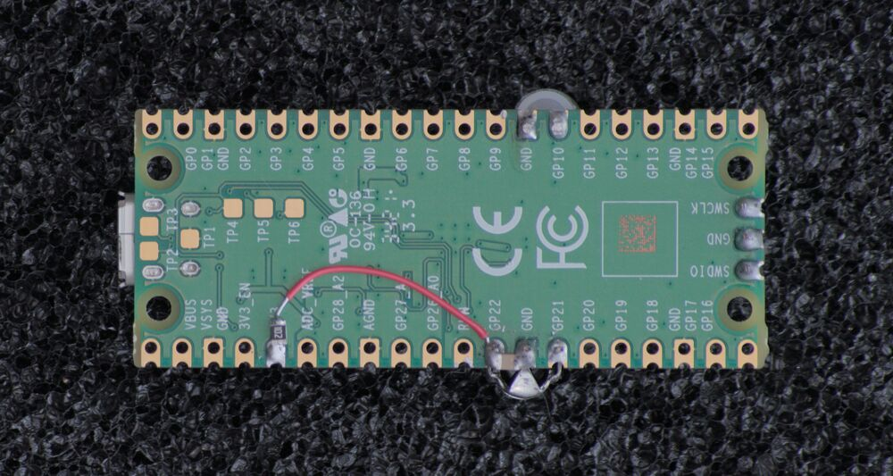

# ir-pico

This is an easy way to get started with an infrared transceiver on Linux.

It's used to receive and send infrared codes, for example, to control a TV or a light.

It is fully supported by the built-in Linux drivers (RC drivers from the media subsystem), and is
compatible with LIRC.

Building the hardware requires soldering skills, and a few components.

## Hardware

### BOM

The exact part numbers are not critical.
The description will help you choose the right parts if you can't access the listed parts.
For example, I have no idea exactly which receiver and LED I actually used,
since they were both unlabeled scrap parts.

| Part                                                               | Description                                                                         |
|--------------------------------------------------------------------|-------------------------------------------------------------------------------------|
| Pi Pico                                                            | The board this is built on                                                          |
| IR7393C LED                                                        | through-hole 940 nm IR LED, any will work                                           |
| IRM-3638T Receiver                                                 | any through-hole 38kHz receiver with 1=out (open collector), 2=GND, 3=3V3 will work |
| 2cm Jumper wire & 1 kΩ 0603 resistor OR 1 kΩ through-hole resistor | a short piece of wire to power the receiver, and a resistor to reduce noise         |
| 100 nF to 10 uF SMD capacitor, 0603/0805                           | value not critical, used to decouple the receiver                                   |

### Assembly

Assemble the board as shown below.

- The flat side of the LED is connected to GND.
- Ceramic capacitors have no polarity.
- You can use a through-hole resistor instead of a combination of jumper wire and SMD resistor.




## Loading the firmware

Grab a uf2 file from the [releases page](https://github.com/flaviutamas/ir-pico/releases).

Then flash it to your Pico. Instructions: ([sourced from here](https://www.raspberrypi.com/documentation/microcontrollers/micropython.html#drag-and-drop-micropython))

To program your device, follow these steps:

1. Push and hold the BOOTSEL button while connecting your Pico with a USB cable to a computer. Release the BOOTSEL button once your Pico appears as a Mass Storage Device called RPI-RP2. 
2. Drag and drop the MicroPython UF2 file onto the RPI-RP2 volume. Your Pico will reboot. You are now running the ir-pico firmware.

## Usage

Standard Linux utilities can be used to control the device:

```console
$ ir-ctl -r  # receive IR codes
$ ir-ctl -S rc5:0x1e01  # send an example IR code
$ ir-ctl --receive=power.txt  # record the IR codes to a file
$ ir-ctl --send=power.txt  # replay the IR codes from a file
```

It is detected by Linux as:

```console
$ ir-keytable
Found /sys/class/rc/rc0/ with:
	Name: Infrared Toy
	Driver: ir_toy
	Default keymap: rc-rc6-mce
	Input device: /dev/input/event23
	LIRC device: /dev/lirc0
	Attached BPF protocols: Operation not permitted
	Supported kernel protocols: lirc rc-5 rc-5-sz jvc sony nec sanyo mce_kbd rc-6 sharp xmp imon rc-mm 
	Enabled kernel protocols: lirc rc-6 
	bus: 3, vendor/product: 04d8:fd08, version: 0x0010
	Repeat delay: 500 ms, repeat period: 125 ms
$ dmesg
usb 3-4.1: new full-speed USB device number 103 using xhci_hcd
usb 3-4.1: New USB device found, idVendor=04d8, idProduct=fd08, bcdDevice= 0.10
usb 3-4.1: New USB device strings: Mfr=1, Product=2, SerialNumber=3
usb 3-4.1: Product: RP2040 Infrared remote transciever (IR Toy)
usb 3-4.1: Manufacturer: flaviutamas.com/p/ir-pico
usb 3-4.1: SerialNumber: 0000001
ir_toy 3-4.1:1.1: version: hardware 0, firmware 2.1, protocol 1
Registered IR keymap rc-rc6-mce
rc rc0: Infrared Toy as /devices/pci0000:00/0000:00:08.1/0000:0e:00.3/usb3/3-4/3-4.1/3-4.1:1.1/rc/rc0
rc rc0: lirc_dev: driver ir_toy registered at minor = 0, raw IR receiver, raw IR transmitter
input: Infrared Toy as /devices/pci0000:00/0000:00:08.1/0000:0e:00.3/usb3/3-4/3-4.1/3-4.1:1.1/rc/rc0/input88
```

## Building

### Install dependencies

```
rustup target install thumbv6m-none-eabi
cargo install flip-link
cargo install --locked probe-rs-tools elf2uf2-rs
```

### Build and flash

With a SWD debugger, so that you get debug output:

```
cargo run --target thumbv6m-none-eabi --release
```

You will see detailed debug and timing output like this:

```
Erasing ✔ 100% [####################]  40.00 KiB @  64.50 KiB/s (took 1s)
  Programming ✔ 100% [####################]  40.00 KiB @  40.08 KiB/s (took 1s)                                                Finished in 1.62s
0.000336 [INFO ] main.rs:263  USB device configured
0.623903 [INFO ] main.rs:158  RX: [ff, ff, 00, 00, 00, 00, 00]
0.623965 [INFO ] main.rs:304  CMD: "Terminator"
0.624053 [INFO ] main.rs:304  CMD: "Terminator"
0.624102 [INFO ] main.rs:304  CMD: "Reset"
0.624145 [INFO ] main.rs:304  CMD: "Reset"
0.624182 [INFO ] main.rs:304  CMD: "Reset"
0.624218 [INFO ] main.rs:304  CMD: "Reset"
0.624252 [INFO ] main.rs:304  CMD: "Reset"
0.624313 [INFO ] main.rs:158  RX: [76]
0.624346 [INFO ] main.rs:304  CMD: "GetVersion"
0.624432 [INFO ] main.rs:185  TX: [56, 30, 32, 31]
0.624501 [INFO ] main.rs:158  RX: [73]
0.624537 [INFO ] main.rs:304  CMD: "EnterIrSampleMode"
0.625610 [INFO ] main.rs:185  TX: [53, 30, 31]
```

Or, to build a '.uf2' file that can be flashed without a debugger:

```
cargo build --target thumbv6m-none-eabi --release
elf2uf2-rs target/thumbv6m-none-eabi/release/ir-pico
```

### Tests

```
cd mylib
cargo test
```

### Python Development

The `py/` directory contains a Python module for interacting with the IR Toy. To set up the development environment:

```bash
cd py/
# Install uv if not already installed
pip install uv

# Create virtual environment and install dependencies
uv sync --extra dev

# Run code formatting and linting
uv run ruff format .
uv run ruff check .
```

## Documentation

- [IR Toy protocol documentation](http://dangerousprototypes.com/docs/USB_IR_Toy:_Sampling_mode)
- [IR Toy self-test mode description](http://dangerousprototypes.com/docs/USB_IR_Toy:Self-test_documentation)
- [LIRC configuration instructions](http://dangerousprototypes.com/docs/USB_IR_Toy:_Configure_LIRC)
- [WinLIRC configuration instructions](http://dangerousprototypes.com/docs/USB_IR_Toy:_Configure_WinLIRC)
- [IR Toy firmware source code](https://github.com/DangerousPrototypes/USB_IR_Toy/blob/master/Firmware-main/main.c)
- [IR Toy Linux driver source code](https://github.com/torvalds/linux/blob/master/drivers/media/rc/ir_toy.c)
- [RP2040 & Rust project template and instructions](https://github.com/rp-rs/rp2040-project-template)
- [Example infrared LED datasheet (IR7393C)](https://en.everlight.com/wp-content/plugins/ItemRelationship/product_files/pdf/IR7393C.pdf)
- [Example infrared receiver datasheet (IRM-3638T)](https://www.everlighteurope.com/custom/files/datasheets/DMO-0000371.pdf)
